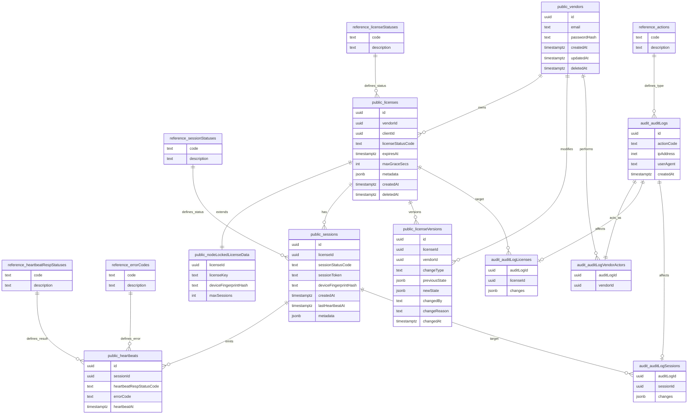

# Database Migrations

This directory contains the PostgreSQL 18 migration scripts for the LaaS (License as a Service) platform.

## Migration Files

Scripts are executed in alphabetical order by the Docker `postgres` image during container initialization.

1.  **`01_schemas.sql`**: Creates the `reference`, `public`, and `audit` schemas.
2.  **`02_reference.sql`**: Seeds lookup tables (statuses, error codes, actions).
3.  **`03_public.sql`**: Defines core business tables, partitions, and indexes.
4.  **`04_audit.sql`**: Sets up immutable audit trail tables with cross-schema references.

---

## Entity Relationship Diagram (ERD)



---

## Post-Migration Verification

After the container starts, you can verify the deployment using the following commands:

### 1. Verify Schemas and Tables
```bash
# Connect to the database (assuming 'app' db name and 'postgres' user)
docker compose exec db psql -U postgres -d app -c "\dn"
docker compose exec db psql -U postgres -d app -c "SELECT schemaname, tablename FROM pg_tables WHERE schemaname IN ('reference','public','audit') ORDER BY schemaname, tablename;"
```

### 2. Check Seed Data Counts
```bash
docker compose exec db psql -U postgres -d app -c "
SELECT 'licenseStatuses: ' || COUNT(*) FROM reference.\"licenseStatuses\"
UNION ALL SELECT 'sessionStatuses: ' || COUNT(*) FROM reference.\"sessionStatuses\"
UNION ALL SELECT 'heartbeatRespStatuses: ' || COUNT(*) FROM reference.\"heartbeatRespStatuses\"
UNION ALL SELECT 'errorCodes: ' || COUNT(*) FROM reference.\"errorCodes\"
UNION ALL SELECT 'actions: ' || COUNT(*) FROM reference.\"actions\";"
```

### 3. Verify Heartbeat Partitions
```bash
docker compose exec db psql -U postgres -d app -c "SELECT tablename FROM pg_tables WHERE tablename LIKE 'heartbeats_%' ORDER BY tablename;"
```

### 4. Check UUIDv7 Defaults
```bash
docker compose exec db psql -U postgres -d app -c "SELECT table_name, column_name, column_default FROM information_schema.columns WHERE table_schema='public' AND column_name='id' AND table_name IN ('vendors', 'licenses', 'sessions');"
```

### 5. Inspect Seed Data Content
```bash
# View all registered statuses, error codes, and audit actions
docker compose exec db psql -U postgres -d app -c "SELECT * FROM reference.\"licenseStatuses\" ORDER BY code;"
docker compose exec db psql -U postgres -d app -c "SELECT * FROM reference.\"sessionStatuses\" ORDER BY code;"
docker compose exec db psql -U postgres -d app -c "SELECT * FROM reference.\"heartbeatRespStatuses\" ORDER BY code;"
docker compose exec db psql -U postgres -d app -c "SELECT code, description FROM reference.\"errorCodes\" ORDER BY code;"
docker compose exec db psql -U postgres -d app -c "SELECT code, description FROM reference.\"actions\" ORDER BY code;"
```

