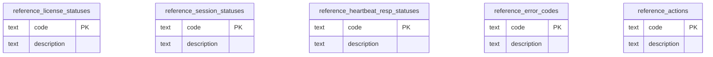

# Database Migrations

This directory contains the PostgreSQL 18 migration scripts for the LaaS (License as a Service) platform.

---

## Migration Files

Scripts are executed in lexicographical order. Each file is idempotent (safe to re-run) and wrapped in a `BEGIN / COMMIT` transaction block.

| # | File | Description |
|---|---|---|
| 01 | `01_roles.sql` | Creates the `reference`, `app`, and `audit` schemas; defines all group roles; assigns schema ownership; sets default privileges. Must run first. |
| 02 | `02_reference.sql` | Creates and seeds all static lookup tables (statuses, error codes, actions) in the `reference` schema. |
| 03 | `03_app.sql` | Creates all core business tables (`vendors`, `licenses`, `node_locked_license_data`, `sessions`, `heartbeats`) in the `app` schema, including range partitions and indexes. |
| 04 | `04_audit.sql` | Creates immutable audit trail tables in the `audit` schema and attaches `BEFORE UPDATE OR DELETE` triggers to enforce append-only semantics. |
| 05 | `05_functions.sql` | Creates app/audit utility functions (`app.set_app_context`, `audit._insert_log`, and explicit-call `audit.log_*` wrappers). |
| 06 | `06_rls.sql` | Enables and enforces RLS policies across `app` and `audit` schema tables. |
| 07 | `07_audit_triggers.sql` | Creates audit trigger functions and attaches business triggers (`vendors`, `sessions`, and `v_license_node_locked` view write/delete routing). |

### Role & Schema Design

All database objects are owned by dedicated group roles (`reference_owner`, `app_owner`, `audit_owner`). Login users are granted group roles and must activate them explicitly:

```sql
-- Per-transaction (recommended for connection pools):
SET LOCAL ROLE app_reader_rls;   -- resets automatically at COMMIT / ROLLBACK

-- Per-session (interactive use):
SET ROLE app_reader_rls;
RESET ROLE;

-- Automatic at session start (single-role login users):
ALTER ROLE <login_user> SET role TO 'app_reader_rls';
```

#### Group Roles Summary

| Role | Schema | Privileges |
|---|---|---|
| `reference_owner` | reference | Owns all objects |
| `reference_reader` | reference | SELECT on tables; EXECUTE on functions |
| `reference_writer` | reference | INSERT, UPDATE on tables; USAGE/SELECT on sequences; EXECUTE on functions |
| `audit_owner` | audit | Owns all objects |
| `audit_writer` | audit | INSERT on tables; USAGE/SELECT on sequences; EXECUTE on functions |
| `audit_reader` | audit | SELECT on audit tables, app.licenses, app.sessions; EXECUTE on app.set_app_context only. EXECUTE on audit._insert_log and all audit.log_* wrappers explicitly revoked |
| `app_owner` | app | Owns all objects |
| `app_reader_rls` | app | SELECT on tables/sequences (RLS applies); EXECUTE on functions |
| `app_reader_bypass` | app | SELECT on tables/sequences (BYPASSRLS); EXECUTE on functions |
| `app_writer` | app | INSERT, UPDATE on tables; USAGE/SELECT on sequences; EXECUTE on functions |
| `app_deleter` | app | SELECT, DELETE on tables; EXECUTE on functions ⚠️ Grant with care — reserve for soft-delete or cleanup service accounts only |

---

## Downgrade Scripts

Downgrade scripts are located in the `down/` subdirectory and must be executed in **reverse order** to safely remove all schema objects while respecting foreign key dependencies.

| Order | File | Description |
|---|---|---|
| 1st | `07_audit_triggers_down.sql` | Removes view/session/vendor audit triggers and related trigger functions |
| 2nd | `06_rls_down.sql` | Drops RLS policies and disables RLS across affected tables |
| 3rd | `05_functions_down.sql` | Drops utility and explicit-call audit functions |
| 4th | `04_audit_down.sql` | Removes audit tables, indexes, and immutability trigger function |
| 5th | `03_app_down.sql` | Removes business tables, partitions, views, and indexes |
| 6th | `02_reference_down.sql` | Removes reference lookup tables |
| 7th | `01_roles_down.sql` | Removes schemas and all group roles |

To downgrade the entire database:

```bash
# Must be run in this exact order to respect FK constraints
docker compose exec db psql -U postgres -d laas -f /docker-entrypoint-initdb.d/down/07_audit_triggers_down.sql
docker compose exec db psql -U postgres -d laas -f /docker-entrypoint-initdb.d/down/06_rls_down.sql
docker compose exec db psql -U postgres -d laas -f /docker-entrypoint-initdb.d/down/05_functions_down.sql
docker compose exec db psql -U postgres -d laas -f /docker-entrypoint-initdb.d/down/04_audit_down.sql
docker compose exec db psql -U postgres -d laas -f /docker-entrypoint-initdb.d/down/03_app_down.sql
docker compose exec db psql -U postgres -d laas -f /docker-entrypoint-initdb.d/down/02_reference_down.sql
docker compose exec db psql -U postgres -d laas -f /docker-entrypoint-initdb.d/down/01_roles_down.sql
```

---

## RLS Design Notes

### `app.vendors` — Intentionally Excluded from RLS

`app.vendors` is the only table in the `app` schema **not** covered by Row-Level Security. This is intentional: vendor isolation via RLS relies on `app.vendor_id` being set in the transaction context (via `app.set_app_context()`), but that call itself requires reading `app.vendors` to authenticate the vendor first. Enabling RLS on `app.vendors` would create an unresolvable circular dependency — you could never authenticate because authentication requires reading a table that requires authentication to read.

Application code is responsible for ensuring that reads of `app.vendors` are scoped correctly (e.g. querying `WHERE email = $1` during login rather than selecting all rows). All downstream tables (`licenses`, `sessions`, `heartbeats`, etc.) are RLS-protected and are automatically filtered once the vendor context is set.

---

## Entity Relationship Diagrams (ERD)

The ERD is split by schema for readability and to keep each diagram focused.

### Reference Schema ERD



### App Schema ERD

```mermaid
erDiagram
    app_vendors {
        uuid id PK
        text email
        text password_hash
        timestamptz created_at
        timestamptz updated_at
        timestamptz deleted_at
    }
    app_licenses {
        uuid id PK
        uuid vendor_id FK
        uuid client_id
        text license_status_code FK
        timestamptz expires_at
        int max_grace_secs
        jsonb metadata
        timestamptz created_at
        timestamptz updated_at
        timestamptz deleted_at
    }
    app_node_locked_license_data {
        uuid license_id PK_FK
        text license_key
        text device_fingerprint_hash
        int max_sessions
    }
    app_sessions {
        uuid id PK
        uuid license_id FK
        text session_status_code FK
        bytea session_token_hash
        text device_fingerprint_hash
        timestamptz created_at
        timestamptz updated_at
        jsonb metadata
    }
    app_heartbeats {
        uuid id PK
        timestamptz heartbeat_at PK
        uuid session_id FK
        text heartbeat_resp_status_code FK
        text error_code FK
    }

    app_vendors      ||--o{ app_licenses                 : "owns"
    app_licenses     ||--o| app_node_locked_license_data : "extends (1:1)"
    app_licenses     ||--o{ app_sessions                 : "has"
    app_sessions     ||--o{ app_heartbeats               : "emits"
```

### Audit Schema ERD

```mermaid
erDiagram
    audit_audit_logs {
        uuid id PK
        text action_code FK
        inet ip_address
        text user_agent
        jsonb metadata
        timestamptz created_at
    }
    audit_audit_log_vendor_actors {
        uuid audit_log_id PK_FK
        uuid vendor_id FK
    }
    audit_audit_log_licenses {
        uuid audit_log_id PK_FK
        uuid license_id FK
        jsonb changes
    }
    audit_audit_log_sessions {
        uuid audit_log_id PK_FK
        uuid session_id FK
        jsonb changes
    }

    audit_audit_logs ||--o| audit_audit_log_vendor_actors : "actor"
    audit_audit_logs ||--o| audit_audit_log_licenses      : "affects"
    audit_audit_logs ||--o| audit_audit_log_sessions      : "affects"
```

### Cross-Schema FK Notes

- `app.licenses.license_status_code` -> `reference.license_statuses.code`
- `app.sessions.session_status_code` -> `reference.session_statuses.code`
- `app.heartbeats.heartbeat_resp_status_code` -> `reference.heartbeat_resp_statuses.code`
- `app.heartbeats.error_code` -> `reference.error_codes.code`
- `audit.audit_logs.action_code` -> `reference.actions.code`
- `audit.audit_log_vendor_actors.vendor_id` -> `app.vendors.id`
- `audit.audit_log_licenses.license_id` -> `app.licenses.id`
- `audit.audit_log_sessions.session_id` -> `app.sessions.id`
